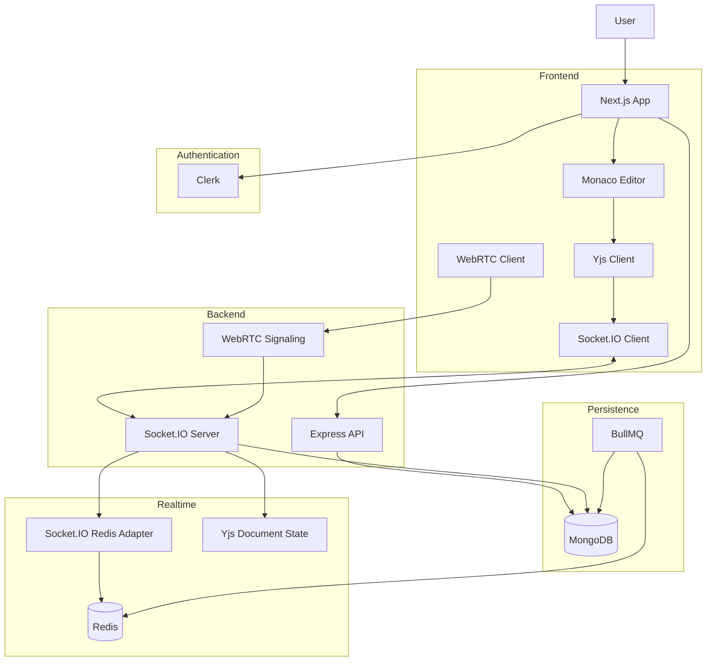

# e-edito Architecture

## Summary

e-edito is a real-time collaborative code editor that enables multiple users to write, edit, execute, and discuss code simultaneously.

The system combines CRDT-based synchronization, real-time communication, version management, chat, and audio/video collaboration into a unified platform.

---

# Tech Stack

## Frontend

* Next.js
* TypeScript
* Tailwind CSS
* Monaco Editor
* Socket.IO Client
* Yjs

## Backend

* Node.js
* Express.js
* Socket.IO

## Database

* MongoDB

## Cache & Messaging

* Redis
* Socket.IO Redis Adapter

## Authentication

* Clerk

## Background Jobs

* BullMQ

## Real-Time Collaboration

* Yjs (CRDT)
* Awareness Protocol

---

# System Architecture


---

# Monorepo Structure

```text
e-edito/

├── apps/
│   ├── web/
│   └── server/
│
├── packages/
│
├── docs/
│
├── package.json
├── pnpm-workspace.yaml
└── turbo.json
```

## Responsibilities

### apps/web

Frontend application.

Responsible for:

* UI
* Authentication
* Monaco Editor
* WebRTC UI
* Socket.IO Client

### apps/server

Backend application.

Responsible for:

* APIs
* Socket.IO Server
* Room Management
* Redis Integration
* WebRTC Signaling

### packages/

Sharerable contents.

---

# Data Flow

User Action
→ Next.js
→ Socket.IO / API
→ Express Server
→ Redis / MongoDB
→ Response Broadcast
→ Connected Clients

For collaborative editing:

Monaco
→ Yjs
→ Socket.IO
→ Redis Adapter
→ Other Participants

---

# Architectural Guardrails

* Frontend must never access MongoDB directly.
* All persistence must go through the backend API.
* Redis is temporary storage and not a source of truth.
* MongoDB is the system of record.
* CRDT document state is the source of truth for real-time editing.
* Database writes must not occur on every keystroke.
* Authentication must be validated through Clerk before accessing protected resources.
