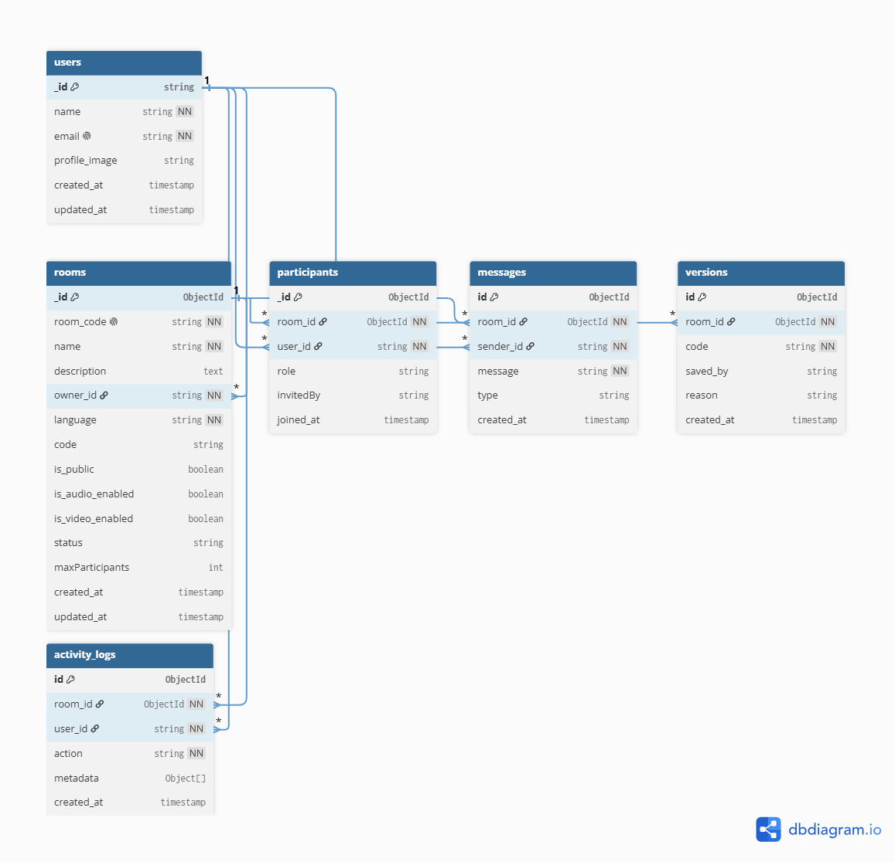

# Database Design - e-edito

## Overview

e-edito uses MongoDB as its primary persistent datastore.

The database is responsible for storing:

* Users
* Rooms
* Participants
* Messages
* Versions
* Activity Logs
* Room Bans (future)
* Execution History (future)

The system follows a document-oriented design where MongoDB acts as the source of truth while Redis manages temporary real-time state.

---

# Database Diagram





---

# Collection Overview

## users

Stores application user information synchronized from Clerk.

### Fields

```ts
_id: string          // Clerk User ID
name: string
email: string
profile_image: string

created_at: Date
updated_at: Date
```

### Relationships

```txt
users
 ├── rooms.owner_id
 ├── participants.user_id
 ├── messages.sender_id
 ├── versions.saved_by
 └── activity_logs.user_id
```

---

## rooms

Represents a collaborative coding room.

### Fields

```ts
_id: ObjectId

room_code: string
name: string
description: string

owner_id: string

language: string
code: string

is_public: boolean

is_audio_enabled: boolean
is_video_enabled: boolean

status: string

maxParticipants: number

created_at: Date
updated_at: Date
```

### Relationships

```txt
rooms
 ├── participants.room_id
 ├── messages.room_id
 ├── versions.room_id
 └── activity_logs.room_id
```

---

## participants

Represents membership of users inside rooms.

### Fields

```ts
_id: ObjectId

room_id: ObjectId
user_id: string

role: string

invitedBy: string

joined_at: Date
```

### Supported Roles

```txt
OWNER
EDITOR
VIEWER
```

---

## messages

Stores room chat messages.

### Fields

```ts
_id: ObjectId

room_id: ObjectId

sender_id: string

message: string

type: string

created_at: Date
```

### Supported Types

```txt
TEXT
SYSTEM
```

### Example System Messages

```txt
John joined room

John left room

Alice started a video call
```

---

## versions

Stores manually saved code snapshots.

### Fields

```ts
_id: ObjectId

room_id: ObjectId

name: string

code: string

saved_by: string

reason: string

created_at: Date
```

### Example

```txt
Version Name:
Before Refactor

Reason:
MANUAL_SAVE
```

### Supported Reasons

```txt
AUTO_SAVE
MANUAL_SAVE
RESTORE_POINT
```

---

## activity_logs

Stores important room events.

### Fields

```ts
_id: ObjectId

room_id: ObjectId

user_id: string

action: string

metadata: object

created_at: Date
```

### Example Actions

```txt
ROOM_CREATED

ROOM_JOINED

ROOM_LEFT

ROLE_CHANGED

PARTICIPANT_REMOVED

PARTICIPANT_BANNED

VERSION_CREATED
```

---

# Future Collections

## room_bans

Stores banned participants.

### Fields

```ts
_id: ObjectId

room_id: ObjectId

user_id: string

banned_by: string

reason: string

created_at: Date
```

---

## executions

Stores code execution history.

### Fields

```ts
_id: ObjectId

room_id: ObjectId

user_id: string

language: string

code: string

output: string

status: string

created_at: Date
```

### Supported Status

```txt
SUCCESS
ERROR
TIMEOUT
```

---

# Recommended Indexes

## users

```txt
email
```

---

## rooms

```txt
room_code
owner_id
```

---

## participants

```txt
room_id
user_id
```

---

## messages

```txt
room_id
created_at
```

---

## versions

```txt
room_id
created_at
```

---

## activity_logs

```txt
room_id
created_at
```

---

# Database Design Principles

* MongoDB is the system of record.
* Redis is not used for permanent storage.
* Real-time cursor and awareness state are stored in Yjs Awareness.
* Room membership is modeled through the participants collection.
* Messages and versions are stored separately from rooms to prevent document growth.
* Database writes should not occur on every editor keystroke.
* Version snapshots should be stored periodically or manually by users.
