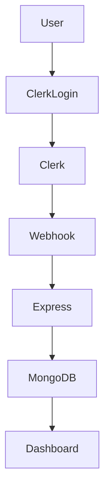
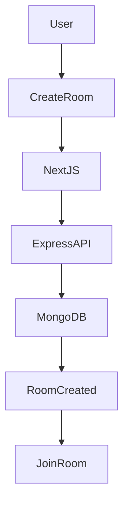
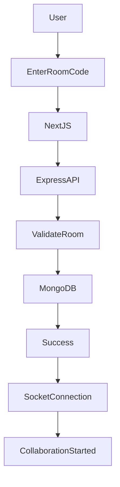
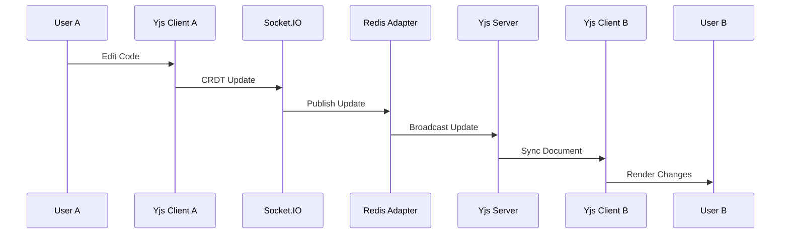
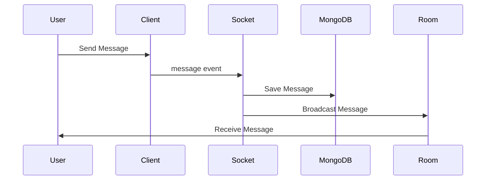
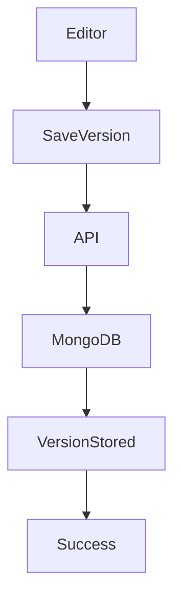
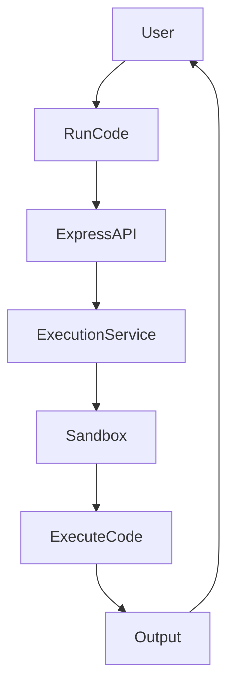
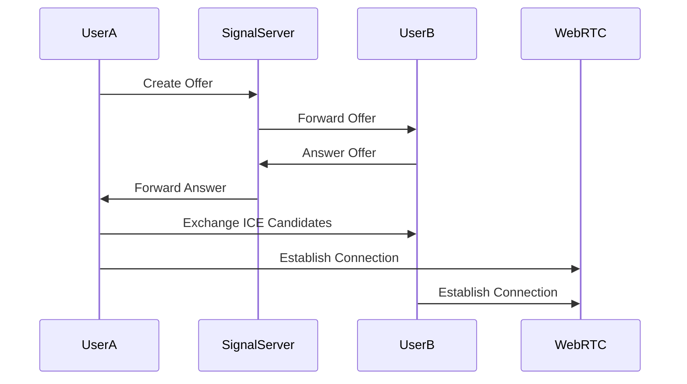
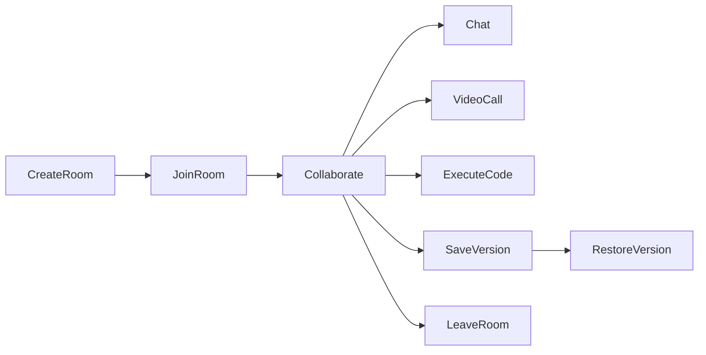
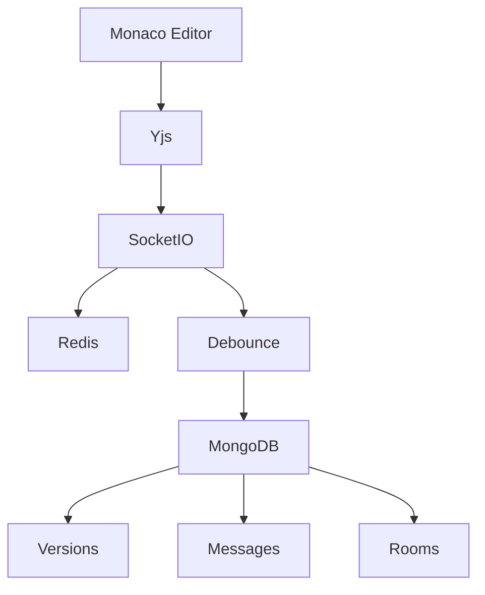

# Flowcharts

## Authentication Flow

---

## Room Creation Flow

---

## Room Join Flow

---

## Collaboration Flow Diagram

---

## Chat Flow

---

## Version Save Flow

---

## Code Execution Flow

---

## Video Call Flow

---

## Room Lifecycle Diagram

---

## Persistence Flow

